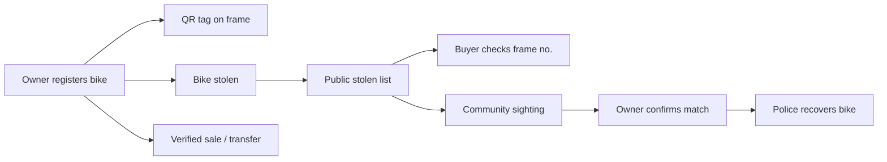
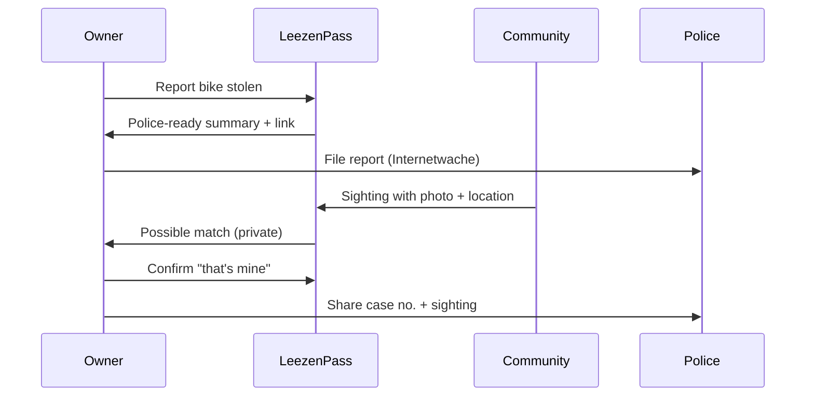
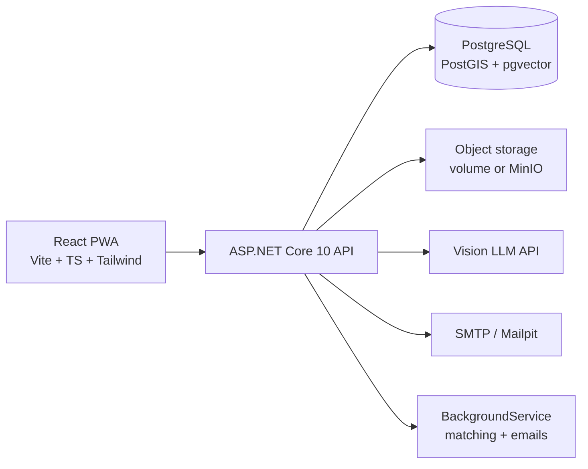

# LeezenPass – MÜNSTERHACK 2026 Plan

Sep 24, 2026 · @Adarsh

## 1. Event overview: MÜNSTERHACK 2026

MÜNSTERHACK is a free, non-profit civic hackathon where Münster's tech scene builds prototypes that make the city more liveable. 2026 is the 10th edition. There is no fixed challenge: participants bring their own ideas, as long as they benefit the city and region.

| Item | Detail |
| --- | --- |
| Dates | Fri 25 – Sat 26 Sep 2026 (roughly 36 hours) |
| Venue | Stadthafen Münster: Digital Hub münsterLAND and items GmbH; partial online participation possible |
| Final pitch | Sat 26 Sep, 16:00, items GmbH, Hafenweg 7 (per Digital Hub listing; earlier editions used the Stadtwerke multipurpose hall) |
| Cost | Free |
| Organisers | Digital Hub münsterLAND with items GmbH; patron: Lord Mayor Tilman Fuchs |
| Team size | Minimum 5 people (per 2025 format) |

### How the event runs

1. Friday 9:00: everyone meets. Idea-givers write their idea on a slip at reception.
2. From 9:30: each idea-giver pitches briefly on stage, verbally, no slides.
3. People gather around the ideas they like and form teams of at least 5, then register at the welcome desk.
4. Hacking Friday and Saturday. Friday evening: internal feedback pitch with mentor feedback.
5. Saturday: public final pitch, then awards.

### Rules

- Only work developed or extended during the hackathon counts. Pre-formed teams are allowed but must stay open to new members and be diverse.
- Remote participation is allowed, but at least one team member should be on site to receive resources and give the final pitch.
- Reusing existing CivicTech solutions is explicitly welcome.
- Open data is encouraged but not mandatory.

### Jury criteria

- Degree of innovation
- Reusability
- Social and ecological sustainability
- Feasibility for Münster and the Münsterland
- Quality of the final presentation

### Prizes

| Prize | Amount |
| --- | --- |
| Jury places 1 / 2 / 3 | €1,000 / €500 / €250 |
| Mentor prize ("nerdiest" solution) | €500 |
| Nachgeha(c)kt prize (best further development of a previous year's project) | €500 |
| Audience prizes 1 / 2 / 3 | €500 / €300 / €200 |
| All participants | Non-cash prizes |

After the event, teams have three weeks to apply for the Solution Enabler Programme, which helps test solutions in Münster. DIGIFARM.MS helps projects find people for long-term maintenance and hosting.

### Resources

- FabLab Münster: AR/VR gear, 3D printers, electronics such as senseBox
- Catering throughout; one guest ticket for the final pitch
- Planned: free AI credits and data:unplugged platform access (confirm on site)
- Mentors from Münster's tech scene, e.g. Katharina Hovestadt (con terra: data integration, FME, geodata)
- Münster Open Data portal with a CKAN-compatible JSON API; contact opendata@citeq.de, 0251/492-1909
- Code for Münster's collection of past MÜNSTERHACK projects and repos

Open question: the exact 2026 hour-by-hour schedule and full mentor list were not confirmed. Check the registration email.

## 2. Problem: bike theft in Münster

Bike theft is Münster's single largest crime category, and the tools that should help have mostly disappeared. Thieves steal bikes because stolen bikes are easy to resell.

| Fact | Figure | Source |
| --- | --- | --- |
| Bike thefts in Münster, 2025 | 4,561 (about one in seven reported crimes) | [Polizei Münster](https://muenster.polizei.nrw/presse/kriminalstatistik-2025) |
| Clearance rate, 2025 | 12.6% (up from 11.65%) | [Polizei Münster](https://muenster.polizei.nrw/presse/kriminalstatistik-2025) |
| Thefts per 100,000 residents | about 1,500, highest in Germany; Göttingen about 1,300, Freiburg about 1,100 | [BikePass](https://bikepass.eu/ratgeber/fahrraddiebstahl-statistik-deutschland/) |
| Average loss per stolen bike (Germany, 2025) | about €1,270 | [polizei-dein-partner.de](https://www.polizei-dein-partner.de/themen/diebstahl-betrug/detailansicht-diebstahl-betrug/artikel/alle-fahrraddaten-stets-mobil-dabei.html) |
| Estimated damage in Münster per year | about €5.8 million (4,561 × €1,270) | Own calculation |

### The gap

- The official police bike-pass app for iPhone and Android has been discontinued ([polizei-beratung.de](https://www.polizei-beratung.de/themen-und-tipps/diebstahl/diebstahl-von-zweiraedern/fahrradpass/)).
- Münster police online bike registration is no longer available; registration only happens at occasional campaign events ([Polizei Münster](https://muenster.polizei.nrw/en/article/online-bike-registration)).
- Private registries exist (fahrradpass.info, fahrrad-gestohlen.de, radklau.org) but are national, fragmented and not tied to Münster's cycling community.
- FEIN coding by ADFC Münsterland works, but only runs on set dates, and there is no easy way for a buyer to check a bike before buying.

## 3. Solution: LeezenPass

LeezenPass is a digital bike pass for Münster that makes stolen bikes hard to sell. Owners register their bike in two minutes, buyers check a frame number before buying, and the community helps recover stolen bikes.

| Lever | What it does | Effect on thieves |
| --- | --- | --- |
| Deter | Registered bikes carry a visible QR tag; FEIN coding is promoted | Registered bikes are harder to sell, so they are less attractive to steal |
| Verify | Buyers check the frame number; sellers transfer ownership digitally | Buyers learn to ask "is it in LeezenPass?", shrinking the market for stolen bikes |
| Recover | Stolen bikes are listed publicly; sightings are matched to owners | More bikes get returned |



The diagram shows the three paths a registered bike can take: normal use with a QR tag, theft and recovery, or a verified sale.

## 4. Features

Four features form the MVP that must work live at the final pitch; pick one or two stretch features depending on team size.

### MVP

**1. Digital bike pass (registry)**

- Records frame number, FEIN code, brand, model, type, colours, e-bike battery serial, distinguishing features, photos (side view, frame-number close-up, details) and purchase receipt.
- AI prefill: the owner uploads a photo; a vision LLM suggests type, colour and brand and reads the frame number from the close-up. The user always confirms. Best demo moment.
- PDF export of the pass for police and insurance.

**2. "Vor dem Kauf prüfen" (check before you buy)**

- Anyone enters a frame number or FEIN code, no login needed.
- Result states:
  - Red, reported stolen: don't buy, contact police. Shows the bike's photo for comparison.
  - Green, registered and the seller has started a transfer: verified sale.
  - Grey, unknown: not in the system, no guarantee either way. Shows a checklist of warning signs.
- Rate-limited and captcha-protected against enumeration.

**3. Theft report**

- Owner marks the bike stolen and adds time, approximate location (map pin), lock type and optionally the police case number.
- Generates a police-ready summary with a link to the Polizei NRW online police station, plus an insurance reminder.
- The bike appears in the public stolen list with photos, attributes and district only, never owner data.
- Share card for WhatsApp, Instagram or nebenan.de.

**4. Ownership transfer ("Verifizierter Verkauf")**

- Seller generates an 8-character transfer code valid for 48 hours.
- Buyer claims it, ownership moves, history is kept.
- Buyer gets a "verified sale" PDF certificate with a QR code. Sellers can advertise "LeezenPass verifiziert" in Kleinanzeigen listings.

### Stretch

**5. QR tag and anonymous finder contact:** a sticker on the frame links to `/b/{token}`. A finder messages the owner through a relay, so no email is exposed. If the bike is reported stolen, the page tells the finder to inform the police. The FabLab could 3D-print a tamper-resistant tag holder.

**6. Sightings and matching:** anyone reports "I saw this bike" with photo, GPS position and time. The system scores it against nearby stolen bikes. Only the owner sees candidate matches and gets police-contact guidance on confirmation.

**7. Risk map and safe parking:** theft reports aggregated into hexagons of about 250 m, shown only with 3 or more reports. Overlaid with OpenStreetMap bike parking (covered, lockers, Radstation) and parking advice.

**8. Partner view (mock):** dashboard for ADFC coding events, where coded bikes are registered on the spot, and for bike shops checking bikes they take in.

### User flow: theft to recovery



## 5. Architecture and tech stack

A React PWA talks to an ASP.NET Core 10 API built on the Ardalis Minimal Clean template (single project, vertical slices, FastEndpoints), backed by PostgreSQL with PostGIS, all run with Docker Compose. The stack matches the team lead's .NET, React, TypeScript and Tailwind experience and uses only stable releases.



| Layer | Choice | Notes |
| --- | --- | --- |
| API | ASP.NET Core 10 (LTS) via `Ardalis.MinimalClean.Template` (`min-clean`) | FastEndpoints, one folder per use case; built-in rate limiter (`Microsoft.AspNetCore.RateLimiting`) |
| Validation | FluentValidation | One validator per request, next to its endpoint |
| Data access | EF Core 10 + Npgsql + NetTopologySuite | PostGIS geometry types |
| Auth | ASP.NET Core Identity, cookie auth | Built-in Identity API endpoints, same-origin cookies; no IdentityServer (see Auth decision below) |
| Database | PostgreSQL + PostGIS (+ pgvector for stretch) | `postgis/postgis` Docker image |
| PDFs | QuestPDF (Community licence) + QRCoder for QR images | See "Why QuestPDF" below |
| Images | SkiaSharp or ImageSharp | Strip EXIF, resize to \~1600 px, thumbnails; check ImageSharp licence |
| Frontend | React 19, Vite, TypeScript, Tailwind v4 | React Router, TanStack Query, react-hook-form + zod |
| Maps | MapLibre GL or react-leaflet with OSM tiles | Overpass API for bike parking, cached as GeoJSON |
| PWA | vite-plugin-pwa | Installable, camera access for photos |
| i18n | react-i18next | German and English |
| Email | Mailpit locally, SMTP in demo |  |
| Captcha | Friendly Captcha or Cloudflare Turnstile | On the public check endpoint |
| DevOps | `docker-compose.yml`: api, web, db, minio, mailpit | Public GitHub repo, MIT or AGPL licence; demo on a small EU VM with a local fallback |

### Architecture decision: Ardalis Minimal Clean, not the full template

Use the Minimal Clean variant. Ardalis describes it as a single-project vertical-slice template for MVPs and smaller apps ([ardalis/CleanArchitecture](https://github.com/ardalis/CleanArchitecture/blob/main/MinimalClean.nuspec)), which fits a 36-hour build. The full template would be overkill.

|  | Full `clean-arch` | `min-clean` (chosen) |
| --- | --- | --- |
| Projects | Core, UseCases, Infrastructure, Web (+ test projects) | One |
| Files per feature | Spread across 3–4 projects | One folder per use case |
| Onboarding for teammates new to it | Hours | Minutes |
| Parallel work in a 5-person team | Merge conflicts across shared layers | Each person owns whole slices |
| Upgrade path | — | Slices and domain can be split into projects later if DIGIFARM.MS takes over |

If the whole backend group already knows the full template well, it is still usable, but the extra layers cost time without adding demo value.

### Code layout

```
leezenpass/
  api/LeezenPass.Api/
    Domain/            Bike, TheftReport, Transfer; value objects FrameNumber, FeinCode
    Features/
      Bikes/Register/  Endpoint, Request, Validator, Response
      Bikes/ExportPass/
      Check/
      Theft/Report/
      Transfers/Create/  Transfers/Claim/
      Sightings/Report/
      RiskMap/Get/
    Infrastructure/    AppDbContext, FileStorage, VisionExtractor, PdfRenderer, EmailSender, Captcha
  api/LeezenPass.Tests/  Unit tests for pure domain logic
  web/                 React + Vite app (src/features/<feature>, src/components, src/api)
  seed/                Demo-data generator
  infra/               docker-compose.yml, .env.example
  docs/                Pitch notes, privacy page, OpenAPI contract
```

### Coding standards (SOLID, applied pragmatically)

Rule of thumb: introduce an interface only where there is an external dependency or a real second implementation. Everything else stays a plain class.

| Principle | How we apply it | Example |
| --- | --- | --- |
| Single responsibility | One endpoint class per use case; domain rules live in the domain, not in endpoints | `FrameNumber` value object owns normalisation and the loose key |
| Open/closed | New behaviour added as new classes, not edits to existing ones | Sighting score = list of `IScoreComponent` (type, colour, brand, distance, time, image); add image similarity without touching the others |
| Liskov substitution | Fakes behave like real implementations, same contracts and errors | `FakeVisionExtractor` returns the same JSON shape as the LLM one |
| Interface segregation | Small, focused interfaces | `IFileStorage`, `IVisionExtractor`, `IPdfRenderer`, `IEmailSender`, `ICaptchaVerifier`, `IClock` |
| Dependency inversion | Endpoints depend on those interfaces; Infrastructure implements them, wired in DI | Swap to offline fakes if event Wi-Fi fails; swap PDF library without touching features |

Conventions:

- Nullable reference types on; `.editorconfig` plus `dotnet format` before each push; analyzer warnings visible but not build-breaking.
- No generic repository on top of EF Core beyond what the template provides.
- Unit tests only for pure logic: `FrameNumber`, scoring, transfer codes. No coverage targets during the hackathon.
- Frontend: ESLint + Prettier, feature folders mirroring the API slices.
- Git: short-lived branches per slice, Conventional Commits, `main` always demoable.

### Auth decision: ASP.NET Core Identity, not IdentityServer

Use ASP.NET Core Identity with cookie auth. Duende IdentityServer is a full OpenID Connect token server for many clients, APIs and single sign-on; LeezenPass is one React app and one API, so it would cost an estimated 3–5 hours of setup with no demo value.

|  | Duende IdentityServer | ASP.NET Core Identity (chosen) |
| --- | --- | --- |
| Services | Separate token server | Inside the API |
| Browser auth | OIDC flows, tokens, CORS | HttpOnly cookie, same origin |
| Licence | Commercial (free community edition) | Part of ASP.NET Core |
| Fits | Many clients, SSO, partner logins | One SPA + one API |

Setup:

- `builder.Services.AddIdentityApiEndpoints<AppUser>()` + `app.MapIdentityApi<AppUser>()` provide register, login, logout and password-reset endpoints; log in with `?useCookies=true`.
- Same origin for React and API: Vite dev proxy locally; in the demo the API serves the built React files, or both sit behind one reverse proxy. No CORS, no tokens in browser storage.
- Cookie: `HttpOnly`, `Secure`, `SameSite=Lax`; antiforgery on state-changing requests.
- Identity tables live in the same Postgres database via EF Core.
- Public endpoints (check, stolen list, QR page, sightings, risk map) need no login; only owner features do.

Later: if police, ADFC or bike shops need their own logins, or other apps need sign-in, add an OIDC provider such as Keycloak or OpenIddict. Auth sits in Infrastructure, so feature slices stay unchanged.

### Why QuestPDF

The app needs two PDFs: the bike pass for police and insurance, and the verified-sale certificate with a QR code.

- Code-first C# fluent API: layout lives next to the feature and is type-checked.
- No headless browser: HTML-to-PDF tools need Chromium in the Docker image, which is heavier and slower to start.
- Good fit for templated documents like certificates.
- Licence: the Community licence is free for individuals, businesses under USD 1 million annual revenue, and open-source projects ([QuestPDF](https://www.questpdf.com/license/community.html)). Set `QuestPDF.Settings.License = LicenseType.Community;` at startup; without a licence setting, the library throws on document generation ([DeepWiki](https://deepwiki.com/QuestPDF/QuestPDF/5.3-licensing-and-community)).
- Caveat: public-sector entities are not eligible regardless of revenue. If Stadt Münster or citeq ever operates LeezenPass, they would need a paid licence or a swap to an MIT library such as PDFsharp/MigraDoc. Because PDF generation sits behind `IPdfRenderer`, that swap stays cheap.

## 6. Data model

Nine tables cover the MVP and stretch features. Owner data stays in `users`; everything public is derived from `bikes`, `bike_photos` and `theft_reports` without personal fields.

| Table | Key columns | Purpose |
| --- | --- | --- |
| `users` | id, email, display\_name, created\_at | Accounts |
| `bikes` | id, owner\_id, public\_token, frame\_no\_raw, frame\_no\_norm, frame\_no\_loose, fein\_code\_hash, brand, model, type, color\_primary, color\_secondary, is\_ebike, battery\_serial, features, purchase\_date, status (active / stolen / recovered), created\_at | The bike pass |
| `bike_photos` | id, bike\_id, kind (side / frame\_no / detail / receipt), path, embedding vector(512) optional | Photos; embeddings for image matching |
| `theft_reports` | id, bike\_id, stolen\_at, location geography(Point,4326), location\_note, lock\_type, police\_case\_no, status (open / recovered / closed) | Theft reports |
| `ownership_transfers` | id, bike\_id, from\_user, to\_user, code\_hash, expires\_at, completed\_at | Verified sales |
| `sightings` | id, reporter\_id (nullable), photo\_path, location geography(Point), seen\_at, type, color, notes | Community sightings |
| `sighting_matches` | sighting\_id, bike\_id, score, owner\_decision (pending / mine / not\_mine) | Matching results, visible to owner only |
| `relay_messages` | id, bike\_id, sender\_contact, body, created\_at | Anonymous finder messages via QR tag |
| `lookups` | id, ip\_hash, query\_hash, result, created\_at | Abuse monitoring for the check endpoint |

Indexes: unique on `frame_no_norm`; index on `frame_no_loose` and `fein_code_hash`; GiST on every geography column; unique on `public_token`.

## 7. API endpoints

Agree this contract as an OpenAPI file in the first hour so frontend and backend can work in parallel.

| Method | Route | Purpose | Auth |
| --- | --- | --- | --- |
| POST | `/api/auth/register`, `/api/auth/login`, `/api/auth/logout` | Accounts | None |
| GET / POST | `/api/bikes` | List own bikes / register a bike | Owner |
| GET / PUT / DELETE | `/api/bikes/{id}` | Manage a bike | Owner |
| POST | `/api/bikes/{id}/photos` | Upload photo (EXIF stripped) | Owner |
| POST | `/api/ai/extract` | Photo in, suggested attributes and frame number out | Owner |
| GET | `/api/bikes/{id}/pass.pdf` | Export bike pass | Owner |
| POST | `/api/bikes/{id}/theft` | Report stolen | Owner |
| POST | `/api/bikes/{id}/recovered` | Mark recovered | Owner |
| GET | `/api/stolen?bbox=&type=&color=` | Public stolen list, no personal data | Public |
| POST | `/api/check` | Frame number or FEIN code in, status out | Public, rate-limited, captcha |
| POST | `/api/bikes/{id}/transfers` | Create transfer code | Owner |
| POST | `/api/transfers/claim` | Claim transfer code | Logged-in buyer |
| GET | `/b/{token}` | QR tag public page | Public |
| POST | `/api/tags/{token}/message` | Relay message to owner | Public, rate-limited |
| POST | `/api/sightings` | Report sighting | Public or logged in |
| GET | `/api/bikes/{id}/matches` | Sighting matches | Owner |
| GET | `/api/riskmap?bbox=` | Hexagon GeoJSON | Public |

## 8. Key implementation details

### Frame-number normalisation

Frame numbers are stamped into metal and often misread, so store an exact key and a "loose" key that treats look-alike characters as equal.

```csharp
static string Norm(string raw) =>
    new(raw.ToUpperInvariant().Where(char.IsLetterOrDigit).ToArray());

static string Loose(string n) => n.Replace('O','0').Replace('I','1').Replace('L','1')
                                  .Replace('S','5').Replace('B','8').Replace('Z','2');
```

A check matches `frame_no_norm` first. If nothing matches, it tries `frame_no_loose` and shows "possible match, compare photos".

### FEIN code privacy

The FEIN code lets police trace the owner's address through the residents' registration office ([ADFC](https://www.adfc.de/artikel/fahrrad-codierung)), so it is personal data. Store only an HMAC hash with a server-side secret and look it up by hash. Link to the [ADFC Münsterland coding form](https://codierung.adfc-ms.de/) for people who want their bike coded.

### Check endpoint

- Return only a status. Show photo, type and colour only for bikes reported stolen, never for merely registered bikes.
- Rate-limit per IP, e.g. 10 checks per 10 minutes.
- Captcha (Friendly Captcha or Turnstile).
- Log hashed IPs and hashed queries to detect scanning.

### Upload privacy

- Strip EXIF data from every photo, especially GPS, which could reveal a home address.
- Resize to about 1600 px and generate thumbnails.

### AI extraction

- Send the photo to a multimodal LLM with a strict JSON schema: `{type, color_primary, color_secondary, brand_guess, features[], frame_number_candidate, confidence}`.
- Show results as editable suggestions; never auto-save.
- Use the hackathon's AI credits if they materialise.

### Sighting matching

Runs in a `BackgroundService` whenever a sighting arrives. Candidates scoring above 0.6 are emailed to the owner; only the owner decides "mine" or "not mine".

```latex
\text{score} = 0.35\,T + 0.25\,C + 0.15\,B + 0.15\,D_{\text{dist}}(\text{half-life } 3\text{ km}) + 0.10\,D_{\text{time}}(\text{half-life } 14\text{ days})
```

T, C and B are type, colour and brand matches (0 or 1). Optionally add CLIP image-embedding cosine similarity via pgvector.

### Risk map

- Aggregate in PostGIS with `ST_HexagonGrid(250, bbox)`, joined against theft locations transformed to EPSG:25832.
- Return only cells with 3 or more reports so no individual location can be pinpointed.
- Load bike parking from the Overpass API (`amenity=bicycle_parking`, tags `covered`, `bicycle_parking=lockers`). Cache it as GeoJSON at startup in case event Wi-Fi is unreliable.

### Transfer codes

- 8 characters from an unambiguous alphabet (no O/0, I/1), stored as a hash, valid 48 hours, single use.
- On claim: change `owner_id`, write a history row, generate the certificate PDF with a QR code pointing to the verification page.

### Seed data

- Script generates about 200 synthetic bikes and about 60 theft reports around Münster.
- Label them clearly as demo data in the UI and pitch; never present them as real hotspots.

## 9. Privacy, legal and abuse cases

The jury will ask about these; each has a prepared answer.

| Risk | Mitigation |
| --- | --- |
| Data protection (GDPR) | Collect only what's needed; no personal data public; one-click deletion; privacy page; EU hosting |
| Fake theft reports to sabotage a sale | Account required, receipt upload; label "self-reported" vs "police case number provided"; recovered status |
| Vigilantism after sightings | Public sees only rough areas; banner "Don't confront anyone, call 110"; LeezenPass supports police, doesn't replace them |
| Scraping Kleinanzeigen | Don't: it breaches their terms. Sellers link their verification from their listing instead |
| Thieves checking whether a bike is registered | Acceptable: that is the deterrence effect |
| Database enumeration via the check | Rate limit, captcha, hashed query logging, minimal responses |
| Location leaks from photos | EXIF stripped on upload |

## 10. Team roles and 36-hour timeline

The team needs at least 5 people; code freeze is Saturday 12:00, four hours before the 16:00 final pitch.

| Role | Responsibilities |
| --- | --- |
| Backend (.NET, EF, PostGIS) | API, data model, check endpoint, transfers, PDF — Adarsh |
| Frontend (React, Tailwind, PWA) | Register, check, my-bikes, stolen list, mobile polish |
| Maps and data | Risk map, Overpass cache, seed script |
| AI | Photo extraction, sighting matching (can combine with frontend or maps) |
| UX, research and pitch (non-coder ideal) | Interview 5–10 cyclists Friday; contact ADFC Münsterland and Radstation; privacy page, slides, demo script |
| Optional: FabLab | QR tag holder or sticker |

| Time | Goal |
| --- | --- |
| Fri 9:00–11:00 | Idea pitch and team formation |
| Fri 11:00–12:30 | Scope MVP, repo and compose skeleton, OpenAPI contract, paper screens |
| Fri 12:30–18:00 | Auth, bike CRUD, photos, check endpoint; frontend for register, check, my-bikes; seed script |
| Fri 18:00–20:00 | Theft report, stolen list, PDF export; clickable flow for the feedback pitch |
| Fri evening / night | Transfer flow, AI extraction, then one of: QR relay, sightings or risk map |
| Sat 9:00–12:00 | Integration, bug fixing, mobile polish, deployment, demo data |
| Sat 12:00 | Code freeze |
| Sat 12:00–15:00 | Rehearse pitch three times; record backup demo video |
| Sat 16:00 | Final pitch |

### Scope priority if time runs short

1. Registry + check endpoint (the core)
2. Theft report + stolen list
3. AI photo prefill (demo impact)
4. Transfer flow
5. One stretch feature

## 11. Pitch

### Friday idea pitch (verbal, about 45 seconds, German)

> „Hallo, ich bin Adarsh. 2025 war in Münster jede siebte angezeigte Straftat ein Fahrraddiebstahl – über 4.500 Leezen, und nur jede achte Tat wird aufgeklärt. Klauen lohnt sich, weil man geklaute Räder problemlos weiterverkaufen kann. Die Polizei-App für den Fahrradpass wurde eingestellt, die Online-Registrierung in Münster gibt's nicht mehr. Meine Idee: LeezenPass – ein digitaler Fahrradpass für Münster. Rad in zwei Minuten registrieren, beim Gebrauchtkauf per Rahmennummer prüfen, ob es geklaut ist, und wenn deins weg ist, hilft die Community beim Wiederfinden. Ich suche Leute für Backend, Frontend, Karten und KI – und jemanden, der gerne pitcht und mit ADFC und Radstation spricht!"

### Final pitch structure

1. Hook: "Hands up if you've ever had a Leeze stolen."
2. Problem: the numbers and the resale market.
3. Live demo, three flows:
   1. Photo in, AI fills the pass.
   2. Buyer checks a frame number and gets red.
   3. Stolen bike gets a sighting; owner gets the match.
4. Impact: about €5.8 million a year in damage.
5. Jury criteria (next table).
6. Next steps: Solution Enabler Programme and DIGIFARM.MS.

Always have the backup demo video ready in case Wi-Fi fails.

| Jury criterion | Our answer |
| --- | --- |
| Innovation | Verified ownership transfer + AI prefill + community sightings in one local app |
| Reusability | Open source, OSM, open data; can roll out to Göttingen and Freiburg, the next-worst cities per capita |
| Sustainability | Keeps bikes in use and strengthens Münster as a cycling city |
| Feasibility for Münster | Partners already exist: ADFC coding, police crime prevention, Radstation |
| Presentation | Live demo of three flows, clear numbers, rehearsed three times |

## 12. Before Friday and after the hackathon

Only work done during the hackathon counts, so don't write project code in advance.

### Before Friday

- [ ] Install or update toolchain: .NET 10 SDK, Node, Docker
- [ ] Install `Ardalis.MinimalClean.Template` and run an empty throwaway project in Docker to confirm it builds (no LeezenPass code yet)
- [ ] Get a vision-LLM API key and test one call on a photo of your own bike
- [ ] Check Code for Münster's MÜNSTERHACK project collection for earlier bike projects (possible Nachgeha(c)kt prize)
- [ ] Ask the Open Data team about bike-related data via opendata.stadt-muenster.de/daten/anfragen
- [ ] Ask 5 friends: "Would you check a frame number before buying a used bike?"
- [ ] Practise the German idea pitch out loud

### After the hackathon

- [ ] Apply to the Solution Enabler Programme within three weeks
- [ ] Offer the project to DIGIFARM.MS for long-term hosting and maintenance
- [ ] Approach ADFC Münsterland to register bikes at coding events
- [ ] Approach the Radstation and bike shops as check partners
- [ ] Talk to Polizei Münster crime prevention about recommending LeezenPass

## Sources

- [MÜNSTERHACK – Hackathon für Münster](https://www.muensterhack.de/)
- [Digital Hub – MÜNSTERHACK Abschlussevent 2026](https://www.digitalhub.ms/events/mshack-abschlussevent)
- [Digital Hub – MÜNSTERHACK 2025 recap](https://www.digitalhub.ms/stories/eventberichte/2025-09-29/muensterhack-2025-nachbericht)
- [items – MÜNSTERHACK archive](https://itemsnet.de/tag/muensterhack/)
- [Open Data Münster – registration for MÜNSTERHACK 2025](https://opendata.stadt-muenster.de/blog/anmeldephase-f%C3%BCr-den-m%C3%BCnsterhack-2025-gestartet)
- [Open Data portal Münster](https://opendata.stadt-muenster.de/)
- [Polizei Münster – Kriminalstatistik 2025](https://muenster.polizei.nrw/presse/kriminalstatistik-2025)
- [BikePass – Fahrraddiebstahl-Statistik](https://bikepass.eu/ratgeber/fahrraddiebstahl-statistik-deutschland/)
- [polizei-dein-partner.de – Fahrradpass](https://www.polizei-dein-partner.de/themen/diebstahl-betrug/detailansicht-diebstahl-betrug/artikel/alle-fahrraddaten-stets-mobil-dabei.html)
- [polizei-beratung.de – Fahrradpass-App](https://www.polizei-beratung.de/themen-und-tipps/diebstahl/diebstahl-von-zweiraedern/fahrradpass/)
- [Polizei Münster – Online bike registration](https://muenster.polizei.nrw/en/article/online-bike-registration)
- [ADFC – Fahrrad-Codierung](https://www.adfc.de/artikel/fahrrad-codierung)
- [ADFC Münsterland – Rahmencodierung](https://muenster.adfc.de/artikel/rahmencodierung)
- [ADFC Münsterland – Codierungsformular](https://codierung.adfc-ms.de/)
- [Open Data Münster on GitHub](https://github.com/od-ms)
