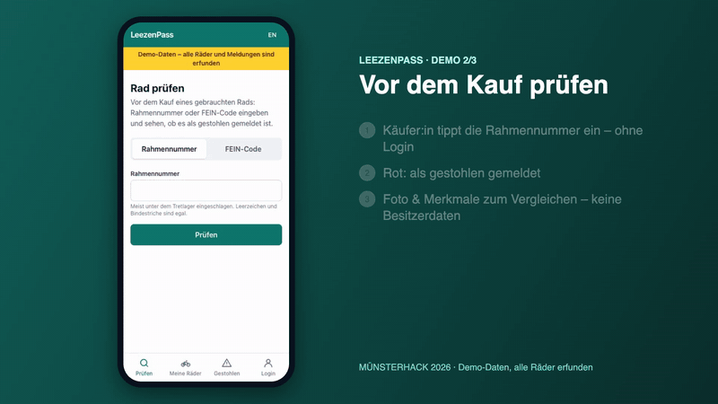

# LeezenPass

**A digital bike pass for Münster that makes stolen bikes hard to sell.**
Built in 36 hours at [MÜNSTERHACK 2026](https://www.muensterhack.de/).



## The problem

Münster has the highest bike-theft rate per resident in Germany. In 2025 the police recorded
**4,561 bike thefts** (about one in seven reported crimes), and only **12.6 %** were solved
([Polizei Münster, Kriminalstatistik 2025](https://muenster.polizei.nrw/presse/kriminalstatistik-2025)).
Bikes are stolen because they are easy to resell, while the police bike-pass app has been discontinued
and online bike registration in Münster no longer exists.

## The idea

LeezenPass attacks the resale market:

- **Deter:** registered bikes with a visible trust level are hard to resell.
- **Verify:** buyers check a frame number before buying; sellers hand over ownership with a one-time code.
- **Recover:** stolen bikes appear on a public list, without any owner data.

## Features

**Built at the hackathon**

- Bike pass with photos and PDF export (for police and insurance)
- AI prefill: type, colours, brand and frame number from photos, with a vision model running locally (Qwen3-VL via LM Studio)
- Public "check before you buy" by frame number or FEIN code, no login, rate-limited, with a captcha
- Theft report, public stolen list and share card
- Ownership transfer with a one-time code, transfer certificate and verification page
- Ownership proof: receipt photo plus a photo of the frame number with a 10-minute one-time code
- Trust levels on every bike: *Selbst angegeben*, *Per Beleg geprüft*, *Von Partner bestätigt*
- Goodwill points and badges for verified outcomes only
- Privacy by design: the check never reveals that a clean bike is registered, FEIN codes are stored only as an HMAC hash, all photo metadata (including GPS) is stripped
- German / English UI, installable PWA, demo-data mode with synthetic seed data

**Planned**

- Partner onboarding for bike shops and ADFC coding events
- Found-bike matching with the city's Fundfahrradstation
- Anonymous finder contact via the QR tag page
- Community sightings matched to stolen bikes
- Theft risk map and safe parking
- Dispute resolution, leaderboard and referrals

## Demo videos

Silent screen recordings from the final pitch, with German UI:

- [Register with AI prefill](docs/pitch/videos/demo-1-ai-prefill.mp4)
- [Check before you buy](docs/pitch/videos/demo-2-check-stolen.mp4)
- [Prove ownership](docs/pitch/videos/demo-3-verify-ownership.mp4)

## Tech stack

ASP.NET Core 10 (FastEndpoints, vertical slices), EF Core 10 with PostgreSQL + PostGIS, ASP.NET Core Identity
(cookie auth), QuestPDF, SkiaSharp · React 19, Vite, TypeScript, Tailwind CSS v4, TanStack Query, react-i18next ·
Docker Compose (PostGIS, MinIO, Mailpit). Specification: [docs/SPEC.md](docs/SPEC.md).

## Run it locally

### Prerequisites

- .NET SDK 10 (`dotnet --version` ≥ 10.0.100)
- Node.js 22 + npm
- Docker (Desktop or compatible)

### First run

```bash
# 1. Infrastructure: PostGIS (5432), MinIO (9000/9001), Mailpit (SMTP 1025, UI 8025)
cp infra/.env.example infra/.env            # optional, defaults work for local dev
docker compose -f infra/docker-compose.yml up -d --wait

# 2. API on http://localhost:5080 (applies migrations on startup)
dotnet tool restore                          # installs dotnet-ef locally
dotnet run --project api/LeezenPass.Api

# 3. Demo data (users, ~200 bikes, 60 theft reports); re-run any time, see seed/README.md
dotnet run --project api/LeezenPass.Api -- seed

# 4. Web on http://localhost:5173 (proxies /api to the API)
cd web && npm install && npm run dev
```

Open http://localhost:5173. On a phone in the same Wi-Fi: `npm run dev -- --host` and open the printed network URL.

Dev config lives in `api/LeezenPass.Api/appsettings.Development.json` (fakes on, demo mode on, dev-only secrets).
Every config key is documented in [infra/.env.example](infra/.env.example).

### Demo accounts

All accounts are **local development / demo accounts** with made-up data. They only exist while
`Features:DemoMode=true`; never reuse these passwords anywhere real.

#### Seeded demo accounts (every machine, after `-- seed`)

Password for all: **`LeezenDemo2026`**

| Email | Role | What it's for |
| --- | --- | --- |
| `owner@demo.local` | – (owner) | Main demo account: Gazelle (stolen), Kalkhoff (open transfer, code `PASS-2345`), Stevens (clean, for the ownership check). 60 goodwill points |
| `buyer@demo.local` | – (buyer) | Claims the Kalkhoff with `PASS-2345`, or the partner bike. Starts with no bikes and 0 points |
| `partner@demo.local` | **Partner** | Bike shop. Owns a Riese & Müller e-bike (`Von Partner bestätigt`); hand it over with a transfer code and the customer gets +10 points |
| `admin@demo.local` | **Admin** | Role exists; there are no admin screens yet (dispute resolution was cut) |
| `nutzer01@demo.local` … `nutzer40@demo.local` | – | Background users who own the other ~190 bikes |

The seed recreates these accounts every time it runs, so data you change with them resets on the next seed.
Frame numbers and codes for the check demo are in [seed/README.md](seed/README.md).

New accounts: register in the app (Login tab → "Konto erstellen"). Passwords need 8+ characters with upper case, lower case
and a digit. Roles can only be assigned by the seed (or directly in the `user_roles` table).

### AI photo prefill (LM Studio)

The Register page can suggest type, colours, brand and frame number from photos. In development this uses
**Qwen3-VL-8B** running locally in [LM Studio](https://lmstudio.ai) (about 6 GB of RAM, works offline):

```bash
~/.lmstudio/bin/lms get qwen/qwen3-vl-8b                          # once, ~5.8 GB
~/.lmstudio/bin/lms server start                                  # OpenAI-compatible API on :1234
~/.lmstudio/bin/lms load qwen/qwen3-vl-8b --context-length 8192   # ~16 s
~/.lmstudio/bin/lms unload --all                                  # free the RAM again
```

If LM Studio isn't running, the form simply stays manual. To use canned suggestions instead set
`Vision__Provider=Fake`. Load the model before the pitch: the API warms it up at startup, but a cold load takes ~16 s.

### Offline / demo mode

`Features:UseFakes=true` (default in Development) swaps email and captcha for fakes, so the demo works without
Wi-Fi. AI vision follows `Vision:Provider` instead: Development uses the local LM Studio model (works offline too);
set `Vision__Provider=Fake` for canned suggestions without LM Studio. `Features:DemoMode=true` makes the web app show the "Demo-Daten" banner.

### Everyday commands

| What | Command |
| --- | --- |
| Build API | `dotnet build api/LeezenPass.slnx` |
| Test API | `dotnet test --solution api/LeezenPass.slnx` |
| Format check | `dotnet format api/LeezenPass.slnx --verify-no-changes` |
| Add migration | `dotnet ef migrations add <Name> --project api/LeezenPass.Api --output-dir Infrastructure/Data/Migrations` |
| Apply migrations | `dotnet ef database update --project api/LeezenPass.Api` |
| Web lint / build | `cd web && npm run lint && npm run build` |
| API docs (dev) | http://localhost:5080/scalar |
| Mail inbox (dev) | http://localhost:8025 |
| MinIO console | http://localhost:9001 (see `infra/.env.example` for login) |
| Reset demo data | `dotnet run --project api/LeezenPass.Api -- seed` |
| Stop infra | `docker compose -f infra/docker-compose.yml down` |

### Layout

```
api/     ASP.NET Core 10 API (FastEndpoints vertical slices) + xUnit tests
web/     React 19 PWA (Vite, Tailwind v4, TanStack Query, react-i18next)
infra/   docker-compose.yml, .env.example
docs/    SPEC.md, pitch videos
seed/    Demo photos and seed notes
```

## Known limitations

- Demo quality: synthetic seed data, no production deployment yet.
- The per-user limit on duplicate frame-number registrations is kept in memory, so it resets on restart and is per instance.
- No admin screens yet (dispute resolution was cut during the hackathon).

## Team

Adarsh, Frank, Niharika, Phillip, Viola. Built at MÜNSTERHACK 2026 in Münster.
See all 2026 projects in the [Code for Münster list](https://github.com/codeformuenster/muensterhack/blob/master/2026.md).

## License

[MIT](LICENSE). Reuse it for your city, and contributions are welcome.
